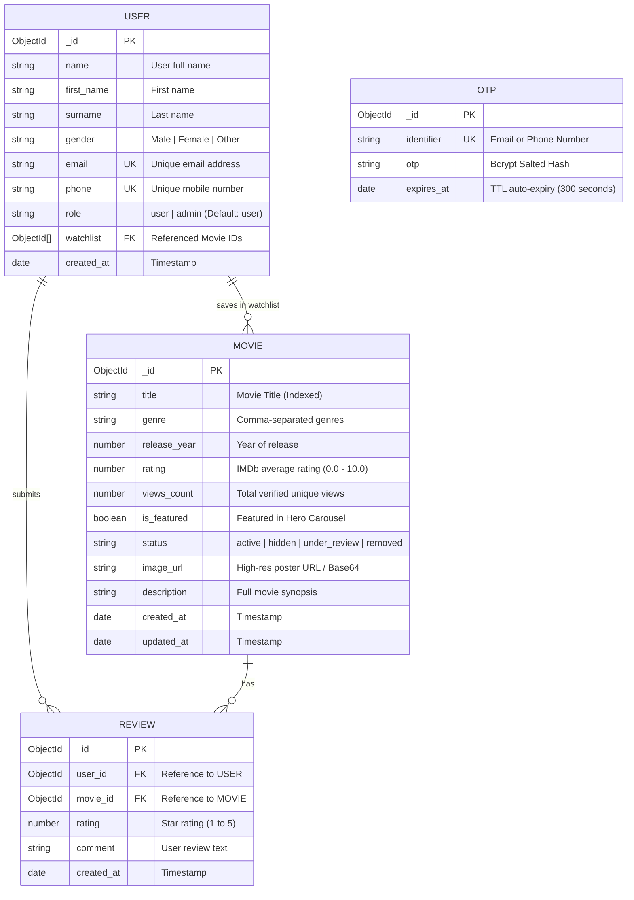

# 🎬 CineVerse - Full-Stack Movie Catalog & Streaming Discovery Platform
## 📖 Comprehensive Technical Documentation & Architecture Report (2026 Edition)

---

## 📌 1. Project Overview & System Concept

### 🎯 1.1 Executive Summary
**CineVerse** is a full-stack, enterprise-grade **Movie Catalog & Streaming Discovery Platform** developed to provide movie enthusiasts with a unified, high-performance portal for movie discovery, official trailer playback, verified IMDb ratings, realistic live view metrics, community reviews, and personalized watchlists.

### 💡 1.2 Purpose & Problem Statement
* **Discovery Fragmentation**: Users often struggle to find consolidated movie metadata, accurate IMDb ratings, and official trailers in one fast, responsive interface.
* **Trailer Restrictions**: Direct embedded iframes often break due to domain blocking and copyright policies; CineVerse uses a verified official studio trailer routing mechanism.
* **Data Accuracy & View Tracking**: CineVerse implements atomic, unique view tracking that prevents view count inflation upon page reloads and back navigation.
* **Persistent Authentication**: Seamless passwordless authentication with Email/SMS OTP and Google OAuth, maintaining sessions across browser restarts until explicit logout.

---

## 🛠️ 2. Technology Stack & Hardware/Software Specifications

### 💻 2.1 Software Specifications & Technology Stack

| Layer | Technology | Version | Purpose |
| :--- | :--- | :--- | :--- |
| **Frontend Framework** | Next.js (App Router, Turbopack) | `16.0.0+` | SSR/CSR hybrid rendering, routing, and fast hydration |
| **Frontend Language** | TypeScript | `5.0+` | Strict type safety, interfaces, and compile-time validation |
| **Styling & Design** | Tailwind CSS | `3.4+` | Glassmorphism, dark cinema aesthetics, responsive grid |
| **Icons & Assets** | Lucide React & FlagCDN | Latest | Modern iconography and dynamic country flag assets |
| **State Management** | React Context API | Built-in | Universal real-time state synchronization across tabs |
| **Backend Runtime** | Node.js | `20.x LTS` | Server-side JavaScript runtime environment |
| **Backend Framework** | Express.js | `4.19+` | RESTful API server, routing, and middleware pipeline |
| **Database** | MongoDB Atlas (NoSQL) | `7.0+` | Cloud document storage with replica sets |
| **ODM / Data Modeling** | Mongoose | `8.0+` | Schema validation, compound indexing, TTL indexes |
| **Security & Auth** | JSON Web Tokens (JWT) & BcryptJS | Latest | Stateless authentication & cryptographic salted hashing |
| **Email Delivery** | Nodemailer | `6.9+` | SMTP relay for high-deliverability 6-digit OTP delivery |
| **External APIs** | OMDb API / IMDb Engine | REST | Live real-world movie ratings and popularity sync |
| **Third-Party Auth** | Firebase Auth (Client SDK) | `11.0+` | 1-Click Google OAuth popup authentication |

### 🖥️ 2.2 System & Hardware Requirements

* **Development Environment**:
  - OS: Windows 10/11, macOS, Linux
  - Node.js: >= v18.0.0
  - RAM: Minimum 4 GB (Recommended 8 GB+)
  - Storage: 1 GB free space for node_modules and assets
* **Production Hosting**:
  - Frontend: Render / Vercel (Edge Network)
  - Backend: Render Web Service (Node.js LTS)
  - Database: MongoDB Atlas (M0 / Dedicated Cluster)

---

## 🏗️ 3. System Architecture & High-Level Design

```
┌────────────────────────────────────────────────────────────────────────────────────────┐
│                              CineVerse 3-Tier Architecture                             │
└───────────────────────────────────────────┬────────────────────────────────────────────┘
                                            │
                                  HTTPS / WSS Requests
                                            ▼
┌────────────────────────────────────────────────────────────────────────────────────────┐
│ 1. PRESENTATION TIER (Next.js 16 + TypeScript + Tailwind CSS)                         │
├────────────────────────────────────────────────────────────────────────────────────────┤
│ • UI Components: Navbar, HeroBanner, FilterBar, MovieGrid, MovieCard, PhoneAuthHero   │
│ • State Stores (React Context):                                                        │
│   - MovieContext (Catalog, Filters, Real-Time In-Store View Sync)                      │
│   - AuthContext (Persistent LocalStorage Token & User State)                           │
│   - WatchlistContext (Optimistic UI Bookmarking)                                       │
│   - ToastContext (Non-blocking Global Feedback Alerts)                                 │
│ • Client Services: API Client (Axios), Official Trailer Engine (YouTube Resolver)      │
└───────────────────────────────────────────┬────────────────────────────────────────────┘
                                            │
                                REST API Calls (JSON)
                                            ▼
┌────────────────────────────────────────────────────────────────────────────────────────┐
│ 2. APPLICATION / BUSINESS LOGIC TIER (Express.js + TypeScript)                         │
├────────────────────────────────────────────────────────────────────────────────────────┤
│ • Middleware Pipeline: Helmet, CORS Whitelist, JWT Verification, Global Error Handler  │
│ • Controllers:                                                                         │
│   - AuthController: Multi-channel OTP, Bcrypt verification, Google OAuth, Profile CRUD │
│   - MovieController: Full-text search, multi-taxonomy filters, atomic view increments │
│   - ReviewController: 5-Star submissions, real-time average score recalculation        │
│ • Background Services: Dynamic OMDb/IMDb Popularity Sync Engine, Nodemailer SMTP Relay │
└───────────────────────────────────────────┬────────────────────────────────────────────┘
                                            │
                                  Mongoose ODM Queries
                                            ▼
┌────────────────────────────────────────────────────────────────────────────────────────┐
│ 3. DATA PERSISTENCE TIER (MongoDB Atlas Cloud Cluster)                                 │
├────────────────────────────────────────────────────────────────────────────────────────┤
│ • Collections:                                                                         │
│   - `users`: User profiles, credentials, role (user/admin), watchlist ObjectIds       │
│   - `movies`: Titles, genres, release years, IMDb ratings, view counts, poster URLs   │
│   - `reviews`: Star ratings (1-5), comments, user & movie foreign keys                │
│   - `otps`: Salted Bcrypt OTP hashes, identifier index, 5-minute TTL auto-expiration   │
└────────────────────────────────────────────────────────────────────────────────────────┘
```

---

## 📋 4. Functional Requirements (FR)

| Requirement ID | Module | Feature / Description | Actor |
| :--- | :--- | :--- | :--- |
| **FR-1.1** | Authentication | Passwordless OTP login/registration via Email (Nodemailer SMTP). | User / Guest |
| **FR-1.2** | Authentication | Passwordless OTP login/registration via Mobile Phone Number (SMS). | User / Guest |
| **FR-1.3** | Authentication | 1-Click Google OAuth popup authentication with automated token issuance. | User / Guest |
| **FR-1.4** | Authentication | Persistent session storage in `localStorage` until explicit user sign-out. | Authenticated User |
| **FR-1.5** | Authentication | Role-based access control (RBAC) protecting `/admin` routes. | Admin |
| **FR-1.6** | Authentication | Searchable Dynamic Country Code Selector (India `+91` default, US, UK, etc.). | User / Guest |
| **FR-2.1** | Movie Catalog | Full-width responsive movie catalog grid (2 to 7 responsive columns). | All |
| **FR-2.2** | Movie Catalog | 350ms debounced real-time instant search by movie title and keywords. | All |
| **FR-2.3** | Movie Catalog | Multi-taxonomy filtering by Genre pills and Release Year (1950–Present). | All |
| **FR-2.4** | Movie Catalog | Multi-criteria sorting (Popularity/Views, Top Rated, Latest, A-Z, Z-A). | All |
| **FR-2.5** | Movie Catalog | Auto-sliding featured Hero Carousel showcasing blockbuster highlights. | All |
| **FR-3.1** | Streaming & Details | Dedicated Movie Details page with metadata, synopsis, and rating badges. | All |
| **FR-3.2** | Streaming & Details | Official studio YouTube trailer launcher bypassing iframe embedding blocks. | All |
| **FR-3.3** | Streaming & Details | Single unique view tracking (+1 on first visit, 0 on back navigation/reload).| All |
| **FR-3.4** | Streaming & Details | Real-time global view count synchronization (`updateMovieInStore`) without F5. | All |
| **FR-4.1** | Reviews & Ratings | Interactive 5-star rating studio with comment submission. | Authenticated User |
| **FR-4.2** | Reviews & Ratings | Automatic recalculation of movie's average rating in MongoDB upon review. | System |
| **FR-4.3** | Reviews & Ratings | Review management (Users can delete own reviews; Admins can delete any). | User / Admin |
| **FR-5.1** | Watchlist & History | 1-Click Bookmark / Watchlist addition and removal with optimistic UI state. | Authenticated User |
| **FR-5.2** | Watchlist & History | Client-side Recently Viewed store tracking last 14 viewed titles. | Authenticated User |
| **FR-6.1** | Admin Studio | Full CRUD management for movies (Add, Edit, Delete, Image Upload/Compression).| Admin Only |
| **FR-6.2** | Admin Studio | Catalog distribution workflow (`Active`, `Hidden`, `Under Review`, `Removed`). | Admin Only |
| **FR-6.3** | Admin Studio | 1-Click live IMDb synchronization for catalog popularity and view metrics. | Admin Only |

---

## ⚡ 5. Non-Functional Requirements (NFR)

| Requirement No. | Description | Category | Standard Met |
| :--- | :--- | :--- | :--- |
| **NFR1** | The system must deliver page loads under 1.5s with a 350ms search debounce to prevent network congestion. | Performance | Sub-1.5s initial load, instant cached transitions |
| **NFR2** | The system must securely hash all OTPs with Bcrypt and enforce a 5-minute TTL auto-expiration index in database. | Security | Zero plain-text OTP storage, zero-leak API responses |
| **NFR3** | The system must provide a fluid, user-friendly interface scaling smoothly across screen sizes from 320px to 4K displays. | Usability | Responsive 2 to 7 column Tailwind CSS grid |
| **NFR4** | The system must maintain user authentication state across browser and tab restarts using persistent storage. | Reliability | Token persistence in `localStorage` with `sessionStorage` sync |
| **NFR5** | The system must accurately count unique movie visits and prevent artificial view count inflation during navigation. | Data Integrity | Atomic MongoDB `$inc` + client-side visited ID cache |
| **NFR6** | The system must be fully compatible with major modern browsers (Chrome, Edge, Firefox, Safari) with zero console errors. | Compatibility | Strict TypeScript 5 + Cross-browser CSS standards |

---

## 🗄️ 6. Database Schema & Data Dictionary

### 6.1 Entity-Relationship (ER) Diagram



### 6.2 Data Dictionary (Collections & Field Definitions)

#### Table: `users`
| Field Name | Data Type | Nullable | Unique | Default | Description |
| :--- | :--- | :--- | :--- | :--- | :--- |
| `_id` | ObjectId | No | Yes | Auto (PK) | Primary key identifier |
| `name` | String | No | No | - | Display name of the user |
| `first_name` | String | Yes | No | - | User first name |
| `surname` | String | Yes | No | - | User last name / surname |
| `gender` | String | Yes | No | - | Gender (`Male`, `Female`, `Other`) |
| `email` | String | Yes | Yes (Sparse) | - | Email address for login and OTP |
| `phone` | String | Yes | Yes (Sparse) | - | Mobile number with country code |
| `role` | String | No | No | `'user'` | Role-based authorization (`'user'`, `'admin'`) |
| `watchlist` | Array[ObjectId]| No | No | `[]` | Array of referenced Movie `_id` values |
| `created_at` | Date | No | No | `Date.now` | User registration timestamp |

#### Table: `movies`
| Field Name | Data Type | Nullable | Unique | Default | Description |
| :--- | :--- | :--- | :--- | :--- | :--- |
| `_id` | ObjectId | No | Yes | Auto (PK) | Primary key identifier |
| `title` | String | No | No | - | Movie title (Text indexed for search) |
| `genre` | String | No | No | - | Primary genres (e.g. "Action, Sci-Fi") |
| `release_year`| Number | No | No | - | Release year (e.g. 2024) |
| `rating` | Number | No | No | `0` | Calculated average rating (0.0 to 10.0) |
| `views_count` | Number | No | No | `0` | Total verified unique view impressions |
| `is_featured` | Boolean | No | No | `false` | Homepage Hero Banner carousel flag |
| `status` | String | No | No | `'active'` | Lifecycle status (`active`, `hidden`, etc.) |
| `image_url` | String | No | No | - | Poster image URL or Base64 data string |
| `description` | String | No | No | - | Detailed synopsis / storyline |

#### Table: `otps`
| Field Name | Data Type | Nullable | Unique | Default | Description |
| :--- | :--- | :--- | :--- | :--- | :--- |
| `_id` | ObjectId | No | Yes | Auto (PK) | Primary key identifier |
| `identifier` | String | No | Yes | - | Destination email or mobile number |
| `otp` | String | No | No | - | Cryptographically salted Bcrypt hash |
| `expires_at` | Date | No | No | `+5 mins` | TTL Index (`expireAfterSeconds: 0`) |

---

## 📡 7. REST API Specifications

### 7.1 Authentication Module (`/api/auth`)

#### `POST /api/auth/phone/send-otp`
- **Description**: Generates a 6-digit cryptographic verification code, hashes it with Bcrypt, stores it with a 5-minute TTL, and transmits it via Nodemailer (Email) or SMS.
- **Request Body**:
```json
{
  "identifier": "+919876543210"
}
```
- **Response (`200 OK`)**:
```json
{
  "success": true,
  "message": "OTP sent successfully to +919876543210"
}
```

#### `POST /api/auth/phone/verify-otp`
- **Description**: Validates candidate OTP against salted Bcrypt hash in database. If valid, provisions or retrieves user profile and returns a signed JWT authentication token.
- **Request Body**:
```json
{
  "identifier": "+919876543210",
  "otp": "482910",
  "name": "Ishit Patel"
}
```
- **Response (`200 OK`)**:
```json
{
  "success": true,
  "token": "eyJhbGciOiJIUzI1NiIsInR5cCI6...",
  "user": {
    "id": "65fc109a8b1c4d0012a45678",
    "name": "Ishit Patel",
    "phone": "+919876543210",
    "role": "user",
    "watchlist": []
  }
}
```

---

### 7.2 Movie Catalog Module (`/api/movies`)

| Method | Endpoint | Query Parameters | Authorization | Description |
| :--- | :--- | :--- | :--- | :--- |
| `GET` | `/api/movies` | `search`, `genre`, `release_year`, `sort`, `status` | Public | Returns paginated/filtered movie catalog |
| `GET` | `/api/movies/:id` | `inc_view=true/false` | Public | Returns movie details. Atomically increments `views_count` (+1) only if `inc_view=true` |
| `GET` | `/api/movies/featured` | None | Public | Returns active Hero Carousel banner movies |
| `GET` | `/api/movies/genres` | None | Public | Returns list of all unique genres in database |
| `POST` | `/api/movies` | None | Admin (Bearer JWT) | Creates new movie entry in database |
| `PUT` | `/api/movies/:id` | None | Admin (Bearer JWT) | Updates existing movie metadata |
| `DELETE`| `/api/movies/:id` | None | Admin (Bearer JWT) | Deletes movie from catalog |
| `POST` | `/api/movies/sync-popularity`| None | Admin (Bearer JWT) | Live sync with OMDb/IMDb ratings & views |

---

## 🔒 8. Security & Optimization Engineering

1. **Zero Plaintext Credentials**: All verification OTP codes are hashed via `bcryptjs` with salt rounds before database insertion.
2. **Zero-Leak API Responses**: Backend responses never send raw OTP strings or password hashes, eliminating devtools inspection attack vectors.
3. **Database TTL Indexes**: Expired OTP records are automatically purged by MongoDB background workers using `expires_at` TTL indexes.
4. **Debounced Network Requests**: 350ms client-side debouncing on search queries prevents server request flooding.
5. **View Deduplication Engine**: Client-side localStorage ID cache ensures users cannot inflate movie view metrics by simply hitting browser back/refresh buttons.
6. **Stateless JWT Authorization**: Secure Bearer tokens with role claims (`user`/`admin`) enforce route guarding at the API middleware layer.

---

## 🚀 9. Deployment & Production Setup

### Environment Variables Configuration

#### Backend (`backend/.env`)
```env
PORT=5000
MONGODB_URI=mongodb+srv://<username>:<password>@cluster0.mongodb.net/cineverse?retryWrites=true&w=majority
JWT_SECRET=your_super_secret_jwt_key_2026
CLIENT_URL=https://movie-catalog-cineverse-frontend.onrender.com
SMTP_HOST=smtp.gmail.com
SMTP_PORT=587
SMTP_USER=cineverse.auth@gmail.com
SMTP_PASS=your_app_password
OMDB_API_KEY=your_omdb_key
```

#### Frontend (`frontend/.env.local`)
```env
NEXT_PUBLIC_API_URL=https://movie-catalog-cineverse.onrender.com/api
```

---

## 🏁 10. Summary & Conclusion
CineVerse represents a modern, resilient, full-stack streaming discovery architecture combining **Next.js 16**, **Express.js**, and **MongoDB Atlas**. With strict TypeScript type safety, persistent passwordless authentication, responsive dark cinema aesthetics, and real-time state synchronization, CineVerse provides an industry-standard solution for movie catalog management and user discovery.
