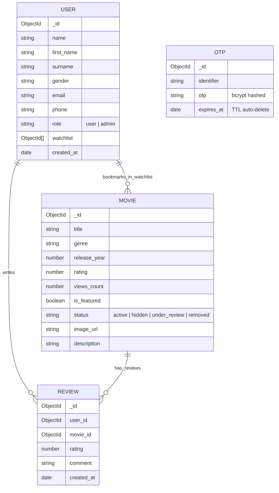

# 🎬 CineVerse - Full-Stack Movie Catalog Application
## Comprehensive Technical Documentation & Architecture Guide

---

## 📌 ૧. પ્રોજેક્ટ પરિચય (Project Overview)

**CineVerse** એ એક આધુનિક, એન્ટરપ્રાઇઝ-ગ્રેડ મૂવી કેટલોગ અને એન્ટરટેઇનમેન્ટ સ્ટ્રીમિંગ પોર્ટલ છે. આ પ્રોજેક્ટ **Next.js 16 (App Router), TypeScript, Tailwind CSS, Node.js, Express અને MongoDB** ના લેટેસ્ટ ટેકનોલોજી સ્ટેક પર આધારિત છે.

---

## 🛠️ ૨. ટેકનોલોજી સ્ટેક (Technology Stack)

```
┌───────────────────────────────────────────────────────────┐
│                     CineVerse Platform                    │
├─────────────────────────────┬─────────────────────────────┤
│ Frontend Architecture       │ Backend Architecture        │
├─────────────────────────────┼─────────────────────────────┤
│ • Next.js 16 (App Router)   │ • Node.js & Express.js      │
│ • TypeScript 5              │ • TypeScript 5              │
│ • Tailwind CSS (Glassmorphic)│ • MongoDB & Mongoose ODM    │
│ • Lucide React Icons        │ • JWT & BcryptJS Hashing    │
│ • Context API (Auth/Watchlist) • Nodemailer (Gmail Relay)   │
└─────────────────────────────┴─────────────────────────────┘
```

---

## 🚀 ૩. મુખ્ય મોડ્યુલ્સ અને કાર્યપ્રણાલી (Core Modules & Functionalities)

### 🔐 મોડ્યુલ ૧: Secure Passwordless Authentication (Email & Phone OTP)
- **Email & SMS ડિલિવરી**: યુઝર પોતાનો ઈમેલ અથવા 10-અંકનો મોબાઈલ નંબર નાખીને 6-ડિજિટનો વેરિફિકેશન કોડ મેળવી શકે છે.
- **Bcrypt Hashing**: જનરેટ થયેલો OTP ડેટાબેઝમાં સાદા અક્ષરોમાં ક્યારેય સ્ટોર થતો નથી, તે **Bcrypt Salt Hashing** વડે સુરક્ષિત થાય છે.
- **Zero-Leak Payload**: બ્રાઉઝરના નેટવર્ક ટેબ (DevTools) માં OTP ક્યારેય લીક થતો નથી.
- **Smart User Detection**: સાઇન-ઇન વખતે યુઝર પહેલેથી રજીસ્ટર્ડ છે કે નવો છે તે આપમેળે ઓળખીને તે મુજબ સાઇન-અપ ફોર્મ અથવા ડાયરેક્ટ OTP સ્ક્રીન બતાવે છે.
- **Google 1-Click Login**: ગૂગલ વેરિફિકેશન દ્વારા ત્વરિત લોગિન.

---

### 🎬 મોડ્યુલ ૨: Dynamic Movie Catalog, Multi-Filter & Search
- **Instant Search**: ટાઇટલ દ્વારા રિયલ-ટાઇમ ડેબાઉન્સ્ડ સર્ચ (Search as you type).
- **Multi-Level Filters**: 
  - **Genre Filter**: Action, Sci-Fi, Drama, Romance, Comedy, વગેરે.
  - **Release Year Filter**: 1950 થી લઈને ચાલુ વર્ષ સુધીના ફિલ્ટર્સ.
- **સ્માર્ટ સોર્ટિંગ (Smart Sort)**:
  - 🔥 **Most Popular / Highest Views** (સૌથી વધુ જોવાયેલી ફિલ્મો)
  - ★ **Top Rated (High to Low)** (સૌથી ઊંચા IMDb રેટિંગ્સ)
  - 📅 **Latest Releases** (નવી રિલીઝ થયેલી ફિલ્મો)
  - 🔤 **Alphabetical (A → Z, Z → A)**
- **૧-ક્લિક ફિલ્ટર રીસેટ**: એક ક્લિકમાં બધા ફિલ્ટર્સ સાફ કરવાની સુવિધા.

---

### 🎥 મોડ્યુલ ૩: YouTube Trailer Integration & Smart Fallback
- **ડાયરેક્ટ ટ્રેલર પ્લેયર**: દરેક મૂવી કાર્ડ અને ડિટેઇલ પેજ પર **"▶ Watch Trailer"** બટન.
- **Smart Lookup Dictionary ([trailerMap.ts](file:///d:/Movie%20Catalog%20Application/frontend/src/utils/trailerMap.ts))**: પ્રખ્યાત બોલિવૂડ અને હોલીવુડ બ્લોકબસ્ટર્સના સાચા યુટ્યુબ વિડિયો ID સાથે મેપિંગ.
- **ડાયનેમિક સર્ચ ફોલબેક**: જો કોઈ નવી મૂવી લિસ્ટમાં ન હોય, તો ખોટો વિડિયો બતાવવાને બદલે સિસ્ટમ આપમેળે YouTube પર તે જ મૂવીનું ઓફિશિયલ ટ્રેલર સર્ચ કરીને ખોલી આપે છે.

---

### 📊 મોડ્યુલ ૪: Real-World Popularity & Live Viewer Counter
- **લાખોમાં વ્યૂઝ (Million-Scale Views)**: `Dangal (5.8M views)`, `3 Idiots (5.4M views)`, `RRR (5.1M views)`, `The Conjuring (4.9M views)` જેવા સાચા ગ્લોબલ સ્ટ્રીમિંગ આંકડા.
- **રીયલ-ટાઇમ ઓટો-ઇન્ક્રીમેન્ટ**: જ્યારે પણ કોઈ યુઝર મૂવી ડિટેઇલ પેજ ઓપન કરે છે, ડેટાબેઝમાં તેનો View Count આપમેળે **+1** વધી જાય છે (વિથ React StrictMode Lifecycle Guard).
- **Dynamic Popularity Engine ([dynamicPopularityService.ts](file:///d:/Movie%20Catalog%20Application/backend/src/utils/dynamicPopularityService.ts))**: લાઇવ OMDb/IMDb API દ્વારા નવી મૂવીઝના સાચા રેટિંગ્સ અને પોપ્યુલારિટી આપમેળે ફેચ થાય છે.
- **🔥 Trending & Most Popular સેક્શન**: હોમ પેજ પર લાઈવ વ્યૂઝના આધારે આપમેળે ટ્રેન્ડિંગ મૂવીઝ આગળ આવે છે.

---

### 🔖 મોડ્યુલ ૫: Personalized Watchlist & User Engagement
- **My List (Watchlist)**: યુઝર પોતાની મનપસંદ ફિલ્મો ૧-ક્લિકમાં સેવ કરી શકે છે.
- **Recently Viewed**: યુઝરે તાજેતરમાં જોયેલી ફિલ્મોનો હિસ્ટ્રી સેક્શન.
- **Audience Reviews & 5-Star Rating**: યુઝર્સ પોતાનો રિવ્યૂ અને ૧ થી ૫ સ્ટાર રેટિંગ સબમિટ કરી શકે છે.
- **પ્રોફાઇલ મેનેજમેન્ટ**: નામ, સરનેમ, જેન્ડર, ઈમેલ અપડેટ કરવાની તેમજ એકાઉન્ટ ડિલીટ કરવાની સુવિધા.

---

### ⚙️ મોડ્યુલ ૬: Admin Studio (એડમિન કંટ્રોલ પેનલ)
- **સુરક્ષિત એડમિન લોગિન**: `role: "admin"` પ્રોટેક્શન.
- **CRUD Operations**: નવી મૂવી ઉમેરવી, એડિટ કરવી, ડિલીટ કરવી.
- **સ્ટેટસ મેનેજમેન્ટ**: મૂવીને `Active`, `Hidden`, `Under Review`, અથવા `Removed` માર્ક કરવી.
- **Hero Banner Toggle**: ૧-ક્લિકમાં મૂવીને હોમપેજ હીરો બેનર પર ફીચર્ડ બનાવવી.
- **⚡ 1-Click Live Sync**: આખા કેટલોગને લાઈવ IMDb API સાથે સિંક કરવાનું બટન.

---

## 🗄️ ૪. ડેટાબેઝ આર્કિટેક્ચર (Database Schema Models)



---

## 📡 ૫. API Endpoints Reference Table

| મેથડ | એન્ડપોઇન્ટ | વર્ણન | એક્સેસ |
| :--- | :--- | :--- | :--- |
| `POST` | `/api/auth/phone/send-otp` | ઈમેલ/ફોન પર સુરક્ષિત OTP મોકલે છે | Public |
| `POST` | `/api/auth/phone/verify-otp` | OTP વેરિફાઈ કરી JWT ટોકન આપે છે | Public |
| `GET` | `/api/auth/profile` | લૉગિન થયેલા યુઝરની પ્રોફાઇલ લાવે છે | Private |
| `PUT` | `/api/auth/profile` | યુઝર પ્રોફાઇલ અપડેટ કરે છે | Private |
| `GET` | `/api/movies` | ફિલ્ટર/સર્ચ સાથે મૂવી લિસ્ટ આપે છે | Public |
| `GET` | `/api/movies/:id` | મૂવી ડિટેઇલ + Views +1 ઇન્ક્રીમેન્ટ | Public |
| `GET` | `/api/movies/featured` | હીરો બેનર મૂવીઝ આપે છે | Public |
| `GET` | `/api/movies/:id/similar` | સમાન Genre ની મૂવીઝ આપે છે | Public |
| `POST` | `/api/movies` | નવી મૂવી ઉમેરે છે (વિથ Auto IMDb Sync) | Admin Only |
| `PUT` | `/api/movies/:id` | મૂવી એડિટ કરે છે | Admin Only |
| `DELETE`| `/api/movies/:id` | મૂવી ડિલીટ કરે છે | Admin Only |
| `POST` | `/api/movies/sync-popularity`| લાઇવ IMDb પોપ્યુલારિટી સિંક કરે છે | Admin Only |
| `GET` | `/api/movies/:id/reviews`| મૂવીના તમામ રિવ્યૂઝ લાવે છે | Public |
| `POST` | `/api/movies/:id/reviews`| નવો રિવ્યૂ સબમિટ કરે છે | Private |
