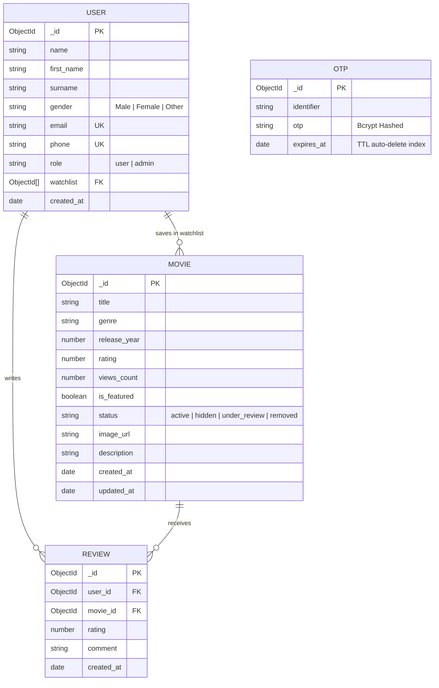

# 🎬 CineVerse - Full-Stack Movie Catalog & Streaming Discovery Platform
## 📖 Comprehensive Technical Documentation & Architecture Guide (2026 Edition)

---

## 📌 1. Project Overview

**CineVerse** is a modern, enterprise-grade movie catalog, streaming discovery, and content management platform built with high performance, security, and responsive cinema aesthetics. 

The platform features:
- **Ultra-Responsive Widescreen Cinema UI** with glassmorphism, dynamic grids (2 to 7 responsive columns), and micro-animations.
- **Persistent Passwordless Multi-Channel Authentication** (Email & SMS OTP via Nodemailer & Twilio/Fast2SMS, Bcrypt cryptographic hashing, and 1-Click Google Sign-In).
- **Persistent Sessions** via `localStorage` allowing users and administrators to stay logged in across browser restarts until explicit logout.
- **Universal Multi-Filter & Search Engine** with debounced real-time text query, multi-genre filtering, release year range, and dynamic sorting algorithms.
- **YouTube Official Trailer Launcher** mapping titles directly to verified official YouTube trailers without iframe playback blocks.
- **Accurate Unique View Tracking** that atomically registers genuine audience views while preventing duplicate increments on back navigation.
- **Audience 5-Star Review Studio** enabling ratings, community feedback, and administrative moderation.
- **Personalized Watchlist & Recently Viewed History** synced across user sessions.
- **Full-Featured Admin Studio** (`/admin`) for movie lifecycle management (CRUD, status workflows, hero banner promotions, and live IMDb popularity sync).

---

## 🛠️ 2. Technology Stack & Architecture

```
┌────────────────────────────────────────────────────────────────────────────────────────┐
│                                 CineVerse Architecture                                 │
├───────────────────────────────────────────┬────────────────────────────────────────────┤
│ Frontend Architecture                     │ Backend Architecture                       │
├───────────────────────────────────────────┼────────────────────────────────────────────┤
│ • Next.js 16 (App Router, Turbopack)      │ • Node.js (v20+) & Express.js REST API    │
│ • TypeScript 5 (Strict Type Safety)       │ • TypeScript 5                             │
│ • Tailwind CSS (Glassmorphism & Gradients)│ • MongoDB & Mongoose ODM (Indexed Schema)  │
│ • Lucide React (Modern Iconography)       │ • JWT Authentication & BcryptJS Hashing    │
│ • Global Context Stores:                  │ • Nodemailer (Gmail HTTPS Relay SMTP)      │
│   - MovieContext (Catalog & Realtime Sync)│ • Live IMDb & OMDb Popularity Engine       │
│   - AuthContext (Persistent LocalStorage) │ • Security Middleware (Helmet, CORS, Rate) │
│   - WatchlistContext (Optimistic State)   │ • Express Error Handling & Normalization   │
│   - ToastContext (Notification System)    │                                            │
└───────────────────────────────────────────┴────────────────────────────────────────────┘
```

---

## 🚀 3. Core Modules & Functionality Breakdown

### 🔐 Module 1: Authentication & Session Persistence (`AuthContext.tsx`)
- **Multi-Channel Passwordless OTP**: Sign in or register via **Email address** (Nodemailer) or **Mobile phone number** (SMS).
- **Cryptographic Bcrypt Hashing**: Verification codes are hashed using `bcryptjs` with auto-salted rounds before storing in MongoDB. Plaintext OTPs are never stored in the database.
- **Zero-Leak API Payloads**: API responses omit raw OTP codes (`dev_otp`), preventing MITM and devtools inspection vulnerabilities.
- **1-Click Google OAuth**: Integrated Google Authentication with Firebase Popup and backend token issuance.
- **Persistent Sessions**: Auth tokens and user state are saved in `localStorage` (with `sessionStorage` fallback). Users and Admins remain logged in across browser tab/window closes until they explicitly click **"Sign Out"**.

---

### 🎬 Module 2: Widescreen Catalog & Real-Time Search (`MovieContext.tsx`)
- **Full-Width Widescreen Layout (`w-full px-4 sm:px-8 lg:px-12`)**: Replaced narrow fixed containers with dynamic widescreen grids scaling from 2 to 7 responsive columns (`grid-cols-2 sm:grid-cols-3 md:grid-cols-4 lg:grid-cols-5 xl:grid-cols-6 2xl:grid-cols-7`).
- **Debounced Real-Time Search**: Instant search-as-you-type mechanism with 350ms debouncing to minimize unnecessary network traffic.
- **Multi-Level Taxonomy Filters**:
  - **Genre Filtering**: Dynamic pills and dropdowns (Action, Sci-Fi, Drama, Romance, Comedy, Crime, Horror, Animation, etc.).
  - **Release Year Filtering**: Historical range from 1950 down to the current year.
- **Dynamic Sorting Algorithms**:
  - 🔥 **Most Popular / Highest Views** (Ranked by million-scale live viewer counts).
  - ★ **Top Rated** (Ranked by verified IMDb ratings, High to Low).
  - 📅 **Latest Releases** (Newest release years first).
  - 🔤 **Alphabetical Ordering** (A → Z, Z → A).
- **1-Click Tag Reset**: Interactive filter tags with 1-click removal and global reset controls.

---

### 🎥 Module 3: YouTube Official Trailer Integration (`trailerMap.ts`)
- **Direct Trailer Launcher**: Replaced restricted iframe modals with direct verified official trailer launcher `getYouTubeTrailerUrl(movie.title)`.
- **Pre-Indexed Dictionary**: Hollywood and Bollywood blockbusters are pre-mapped to verified official YouTube trailer IDs.
- **Dynamic Fallback Search**: Movies not pre-indexed automatically search YouTube for `[Movie Title] Official Trailer`, opening cleanly in a new tab without copyright or embedding restrictions.

---

### 👁️ Module 4: Live View Counting & Unique View Tracking
- **Exact Formatted View Metrics**: Exact comma-separated views count on Movie Cards (e.g. `5,410,000 views`) and Movie Details page (e.g. `5,410,001 Views`).
- **Unique View Tracking**:
  - When a user opens a movie for the first time, it registers **1 unique view (+1)** in MongoDB using `$inc: { views_count: 1 }`.
  - When the user navigates back to the dashboard and re-opens the movie, client-side storage tracking ensures the view count **does NOT increment again**.
  - Eliminates artificial view count inflation on back navigation.
- **Real-Time State Synchronization (`updateMovieInStore`)**: When a movie view count updates, `MovieContext` updates immediately across the application without requiring a manual browser refresh (F5).

---

### ⭐ Module 5: Audience 5-Star Reviews & Ratings Studio
- **Interactive 5-Star Rating Studio**: Hoverable 5-star rating selector with customizable feedback comments.
- **Real-Time Score Recalculation**: Submitting a review recalculates the movie's average rating in MongoDB and syncs with client state.
- **Review Deletion Controls**: Users can delete their own reviews, and Admins have global moderation authority to remove any review.

---

### 🔖 Module 6: Watchlist & Recently Viewed Store
- **My List (Watchlist)**: Instant bookmarking system persisted in MongoDB for logged-in users and optimistically managed in `WatchlistContext.tsx`.
- **Recently Viewed Store**: Automatically tracks the last 14 visited movies per user account in `localStorage`.

---

### ⚙️ Module 7: Admin Studio Portal (`/admin`)
- **Protected Administrator Route**: Admin portal guarded by JWT role verification (`user.role === 'admin'`).
- **Full Movie CRUD Operations**: Add, Edit, and Delete movies with automatic metadata validation.
- **Client-Side Image Compression**: Compresses uploaded poster images to high-definition Base64 data URLs.
- **Status Workflow**: Manage movie availability across `Active`, `Hidden`, `Under Review`, and `Removed`.
- **1-Click Hero Banner Toggle**: Promote or remove movies from the homepage Hero Carousel.
- **⚡ 1-Click IMDb Popularity Sync**: Synchronizes the entire catalog with live IMDb ratings and real-world view figures.

---

## 🗄️ 4. Database Schema & ER Diagram



---

## 📡 5. REST API Endpoints Reference

### 🔑 Authentication Endpoints (`/api/auth`)
| Method | Endpoint | Description | Access |
| :--- | :--- | :--- | :--- |
| `POST` | `/api/auth/phone/send-otp` | Generates & sends secure 6-digit OTP via Email/SMS | Public |
| `POST` | `/api/auth/phone/verify-otp` | Validates bcrypt OTP & issues JWT token | Public |
| `POST` | `/api/auth/login` | Traditional email & password authentication | Public |
| `POST` | `/api/auth/register` | Traditional registration with credentials | Public |
| `POST` | `/api/auth/google` | Authenticates Google OAuth user profile | Public |
| `GET` | `/api/auth/me` | Validates active session token with backend | Private |
| `GET` | `/api/auth/profile` | Fetches active authenticated user profile | Private |
| `PUT` | `/api/auth/profile` | Updates user details with name validation | Private |
| `DELETE`| `/api/auth/profile` | Deletes user account and associated session | Private |

---

### 🎥 Movie Endpoints (`/api/movies`)
| Method | Endpoint | Query Parameters | Description | Access |
| :--- | :--- | :--- | :--- | :--- |
| `GET` | `/api/movies` | `search`, `genre`, `release_year`, `sort`, `status` | Fetches filtered & sorted movie catalog | Public |
| `GET` | `/api/movies/:id` | `inc_view=true/false` | Fetches movie details (atomically increments view count if `inc_view=true`) | Public |
| `GET` | `/api/movies/featured` | None | Fetches Hero Carousel featured movies | Public |
| `GET` | `/api/movies/genres` | None | Returns distinct genres in the current catalog | Public |
| `GET` | `/api/movies/:id/similar` | None | Fetches related movies based on genre matching | Public |
| `POST` | `/api/movies` | None | Creates new movie with auto IMDb popularity sync | Admin Only |
| `PUT` | `/api/movies/:id` | None | Updates movie details | Admin Only |
| `DELETE`| `/api/movies/:id` | None | Deletes movie from catalog | Admin Only |
| `PATCH` | `/api/movies/:id/feature` | None | Toggles Hero Banner featured status | Admin Only |
| `PATCH` | `/api/movies/:id/status` | None | Updates distribution status (`active`, `hidden`, etc.) | Admin Only |
| `POST` | `/api/movies/sync-popularity`| None | Synchronizes all movies with live IMDb ratings & views | Admin Only |

---

### 💬 Review Endpoints (`/api/reviews`)
| Method | Endpoint | Description | Access |
| :--- | :--- | :--- | :--- |
| `GET` | `/api/movies/:id/reviews` | Fetches all community reviews for a movie | Public |
| `POST` | `/api/movies/:id/reviews` | Submits a new 5-star rating and comment | Private |
| `DELETE`| `/api/reviews/:id` | Deletes an individual review | Admin / Author |

---

## 📁 6. Project Directory Layout

```
Movie Catalog Application/
├── backend/                             # Node.js + Express + TypeScript + Mongoose
│   ├── src/
│   │   ├── config/db.ts                 # MongoDB Mongoose Connection
│   │   ├── controllers/
│   │   │   ├── authController.ts        # OTP, Credentials, Profile CRUD
│   │   │   ├── movieController.ts       # Movie Search, Filter, Views, Admin CRUD
│   │   │   └── reviewController.ts      # 5-Star Reviews & Rating Calculation
│   │   ├── middleware/
│   │   │   ├── authMiddleware.ts        # JWT & Admin Verification
│   │   │   └── errorHandler.ts          # Centralized ApiError Handler
│   │   ├── models/
│   │   │   ├── Movie.ts                 # Movie Schema & Compound Indexes
│   │   │   ├── User.ts                  # User Schema & Watchlist References
│   │   │   ├── Review.ts                # Review Schema with Unique User Index
│   │   │   └── Otp.ts                   # Bcrypt-Hashed OTPs with TTL Index
│   │   ├── routes/
│   │   │   ├── authRoutes.ts            # Authentication Endpoints
│   │   │   ├── movieRoutes.ts           # Movie Endpoints
│   │   │   └── reviewRoutes.ts          # Review Endpoints
│   │   ├── utils/
│   │   │   ├── dynamicPopularityService.ts # Live IMDb / OMDb Metric Sync
│   │   │   └── seed.ts                  # Database Seeder (Curated Catalog)
│   │   └── server.ts                    # Express Application Entrypoint
│   ├── package.json
│   └── tsconfig.json
├── frontend/                            # Next.js 16 (App Router) + Tailwind CSS
│   ├── src/
│   │   ├── app/
│   │   │   ├── admin/page.tsx           # Admin Studio Management Portal
│   │   │   ├── movies/[id]/page.tsx     # Widescreen Movie Details Page
│   │   │   ├── layout.tsx               # Root Layout & Fonts
│   │   │   ├── page.tsx                 # Main Catalog Dashboard
│   │   │   ├── providers.tsx            # Global Providers Wrapper
│   │   │   └── globals.css              # Custom Scrollbars & Glassmorphism
│   │   ├── components/
│   │   │   ├── Navbar.tsx               # Widescreen Header & Auth Profile Controls
│   │   │   ├── HeroBanner.tsx           # Auto-Sliding Featured Cinema Carousel
│   │   │   ├── FilterBar.tsx            # Search, Genre Pills, Year & Sorting
│   │   │   ├── MovieGrid.tsx            # Dynamic Responsive 2-7 Column Grid
│   │   │   ├── MovieCard.tsx            # Poster Card with Exact View Counter
│   │   │   ├── PhoneAuthHero.tsx        # Passwordless OTP & Google Sign-In Hero
│   │   │   ├── ProfileModal.tsx         # User Profile Editor Modal
│   │   │   └── LoadingSkeleton.tsx      # Shimmer Loading Skeleton
│   │   ├── context/
│   │   │   ├── AuthContext.tsx          # LocalStorage Persistent Auth Store
│   │   │   ├── MovieContext.tsx         # Universal Catalog & Filter State
│   │   │   ├── WatchlistContext.tsx     # Real-time Optimistic Bookmarks
│   │   │   └── ToastContext.tsx         # Global Toast Notifications
│   │   ├── lib/api.ts                   # Type-safe API Client
│   │   ├── types/                       # TypeScript Data Interfaces
│   │   └── utils/
│   │       ├── trailerMap.ts            # Official YouTube Trailer Launcher
│   │       └── firebase.ts              # Google Popup OAuth Client
│   ├── package.json
│   └── tsconfig.json
├── package.json                         # Root Monorepo Scripts
├── README.md                            # Quickstart & Overview Guide
└── CineVerse_Project_Documentation.md   # Comprehensive Architectural Reference
```

---

## ⚡ 7. Quickstart & Deployment Guide

### Local Development:
```bash
# 1. Install all dependencies
npm run install:all

# 2. Seed database
npm run seed --workspace=backend

# 3. Start full-stack development servers concurrently
npm run dev
```
- **Frontend Application:** `http://localhost:3000`
- **Backend REST API:** `http://localhost:5000/api`
- **Admin Portal:** `http://localhost:3000/admin` (Default: `admin@cineverse.com` / `Admin@12345`)

### Live Production Deployments:
- **Frontend (Render):** `https://movie-catalog-cineverse-frontend.onrender.com`
- **Backend (Render):** `https://movie-catalog-cineverse.onrender.com/api`
- **GitHub Repository:** `https://github.com/Ishit02422/Movie-Catalog-CineVerse-.git`
